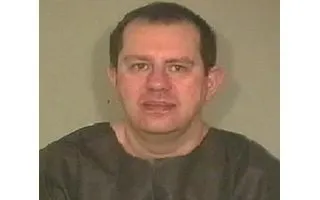

# The urban street cartel exposed in Colne Valley

Back in 2010, I was asked to participate in a strike op against a local businessman who had been observed acting strangely, and was seen to have caches of computer equipment, mainly hard drives, that had been carefully hidden in empty properties that he owned.  The man, Roy Stobbs, had a previous conviction for a sexual offence involving children.

The strike involved entering one of the properties to retrieve some of the drives for analysis and hopefully to be handed in to the police and used as evidence. My job was to receive the hardware and to setup a forensics lab in a locked down part of the house whilst we studied the storage devices and made some attempt to crack any encrypted files or volumes that we encountered.

The retrieval didn't go exactly according to plan, because the raiders had neglected to wear face masks and were caught on CCTV whilst they were robbing the premises. Stobbs was so sure that he had covered his tracks that he had a warrant issued against the men - although this put undue strain on our team it also meant that Stobbs could not deny ownership of the devices. So the lock-up had to be made secure.

After several weeks it seemed that we weren't getting anywhere. Then, a series of lucky breaks occured that lead to a successful outcome.

Firstly, the police got in touch, and rather than raid our property to enforce their warrant, they agreed to give a few weeks grace after being allowed to view the digital forensics lockup and were reassured that there were no drugs or smuggling going on. The same police later became regular visitors to our lab, where we taught them the necessary skills that they would need to confront trafficking in the online era.

Secondly, out of the blue, an 0day (unresolved exploit) was released that affected the encryption tool used by the ring. This was a very common piece of software, and the owners had issued an alert to the effect that all previous versions of the software were vulnerable to an exploit that could entirely bypass the encryption in its entirety, meaning that all files created by the software prior to a certain date could be easily accessed with no keys or pass-phrases. So that meant that our work was reaching fruition, as the most difficult part had been accomplished, completely by chance.

These caches were huge, and also contained personal data of ring members and access codes for their network of sites hosted on the dark web (at "freedom hosting" for the most part, which went down not long aftwerwards).

Shortly afterwards, we got in touch with the police, and this lead to a string of arrests. 

### [Slaithwaite man Roy Stobbs and Birkby man James Metcalfe each charged with a string of child sex offences](https://archive.ph/1SvPP)

TWO Huddersfield men have appeared in court in connection with separate child sex offences.

* 08:00, 5 MAR 2010
* Updated 03:44, 12 JUL 2013

### [Slaithwaite child porn man Roy Stobbs ‘a potential danger’ to kids](https://archive.ph/5KqOf)

A CONVICTED sex offender who downloaded nearly 7,000 indecent images of children has escaped a prison term after a judge said he may only spend a few weeks behind bars if he passed the appropriate sentence.

* 05:00, 27 MAY 2010
* Updated 03:21, 12 JUL 2013

### [Marsh man Christopher Metcalfe jailed for five years for sex crimes](https://archive.ph/w1upl)

A SEX abuser has been jailed for more than five years.

* 05:00, 27 NOV 2010
* Updated 01:46, 12 JUL 2013

### [Huddersfield sex abuser Christopher Metcalfe wins cut in sentence](https://archive.ph/veTsj)

A “DANGEROUS” Huddersfield paedophile who was jailed for sex attacks on a young girl has won a cut in his jail sentence.

* 05:00, 31 MAR 2011
* Updated 00:44, 12 JUL 2013

### [MP Barry Sheerman angry over Christopher Metcalfe sex case appeal ruling](https://archive.ph/cBs3s)

THE decision to cut the jail sentence for child abuser Christopher Metcalfe provoked anger from Huddersfield MP Barry Sheerman.

* 08:47, 31 MAR 2011
* Updated 00:44, 12 JUL 2013

The evidence we supplied was not used in court for this case, we did see some incriminating documents concerning this unhealthy specimen: DC Michael Vause

### [Exclusive: Ex-detective admits string of child porn offences](https://archive.ph/OzBJV)

A FORMER West Yorkshire detective who continued to work for the force as a civilian investigator has pleaded guilty to a string of child pornography offences.

Saturday, 9th June 2012, 7:00 am

Also see this article on [police pedophiles](http://upsd.co.uk/rogue-officers/police-paedophiles/).

Although Stobbs did not receive a custodial sentence first time round, the police later uncovered more caches. 

### [Meltham man Roy Stobbs on trial accused of 25 charges of making indecent images of children](https://archive.ph/s9XoA)

The court heard that forensic experts recovered the images after attempts had been made to delete them from both computers, the first of which Stobbs maintains he got second hand

* 08:06, 29 JUL 2014
* Updated19:20, 31 JUL 2014

### [Meltham man Roy Stobbs jailed for second lot of child porn crimes](https://archive.ph/tuIRz)

Second offence for porn pervert

* 08:06, 28 AUG 2014
* Updated 08:08, 28 AUG 2014