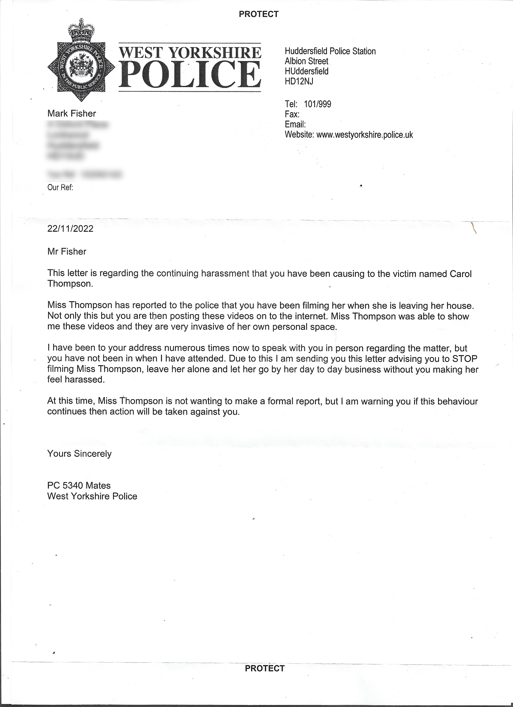
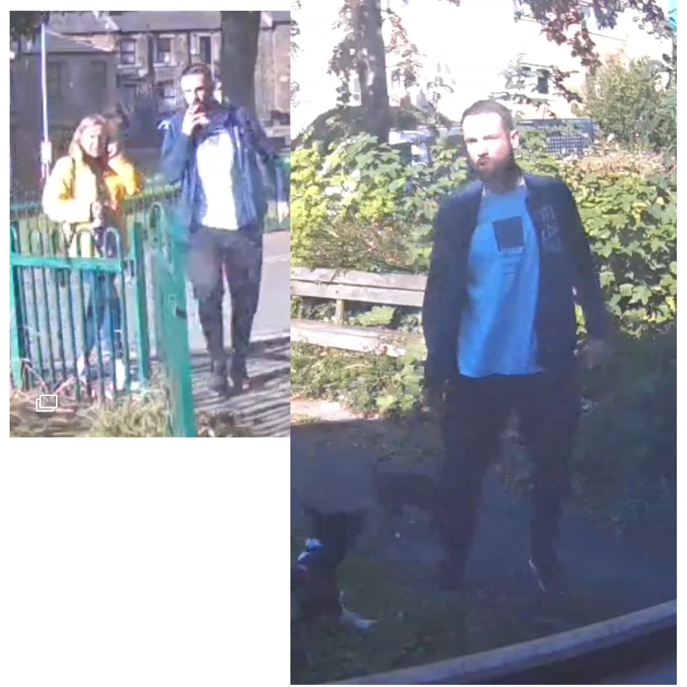

What law in the land does 5340 Mates of Huddersfield imagine can allow her to prevent a person from installing thier own security camera and filming thier own front garden through their own bedroom window?

This letter came recently from Mates. She states that she has visited the property - why did she not leave a card? Why has she not disclosed the dates so that her alleged visits may be verified on the very same camera that she sees as her enemy? 

She has been colluding with these people who have
been spotted on numerous occasions sneaking around
behind my property, causing acts of vandalism, and
filming with their phones into my kitchen and 
bathroom during times when I had guests who where
using the shower during the times of these 
incidents.

They have also been captured trying to goad the 
young dog that lives here, in an attempt to make 
him turn fierce.

These and many other incidents have all been 
captured for all time on this tiny camera.

PC Mates has also been seeen sneaking around 
my propery, along with sex offender Richard
Tasker,
during the time that she alleges I made posts
on social media in breach of a mysterious 
restraining order imposed as part of the 
sentence for a public order offence - that
of being "grossly offensive on a public network"
yet no explanation was given as to why the
order was put in place.  She refuses to supply
the URL of the posts, instead producing crudely
constructed print-outs of supposed screen-shots - 
however, without the original binaries, we cannot
examine these to ensure their validity.

It seems as though the
officers deliberately arranged the restraining
order in advance, then in collaboration with
Tasker, entered my home and interfered with 
equipment in such a way as to create some kind of
breach of the order, which they then arrested me 
and are attempting to prosecute me for.

However, they have been very vague as to the 
location and nature of these alleged posts, 
presumably in an attempt to elude detection.

