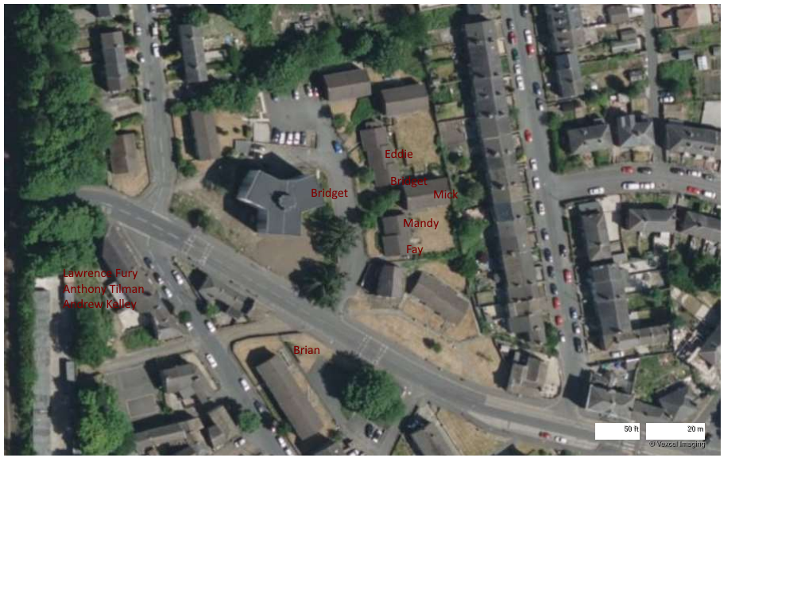

### The map shows most of the recent deaths in this area (Swan Court, Lockwood, Huddersfield)

One or two people are missing from the list - Bobby Grace for example.

The symptoms preceding the deaths, in every case, was horrific.

### One or two of the residents have been acting very strangely...

And secure sources indicate the Arena bomber may have used the alleys and some of the flats as a hideaway.

## Were these people witnesses to the suspicious activity?

This causes a perceived connection between Exaro News, Kirklees Council, and the Manchester Arena Bombing.

### May the souls of those departed eventually find peace. Amen.
