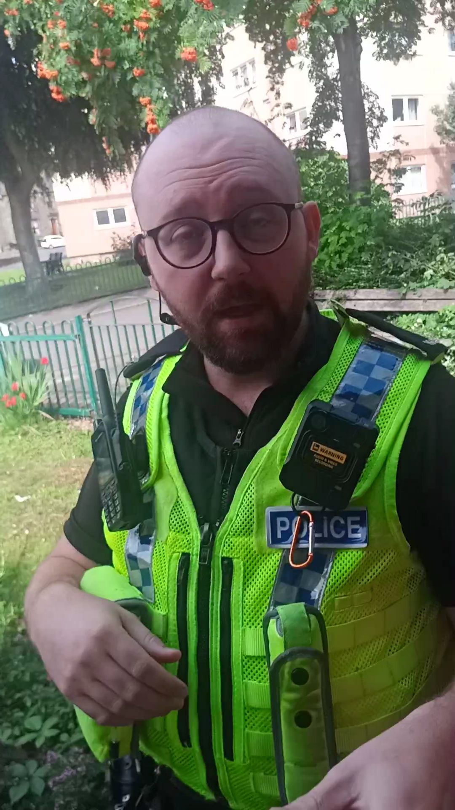
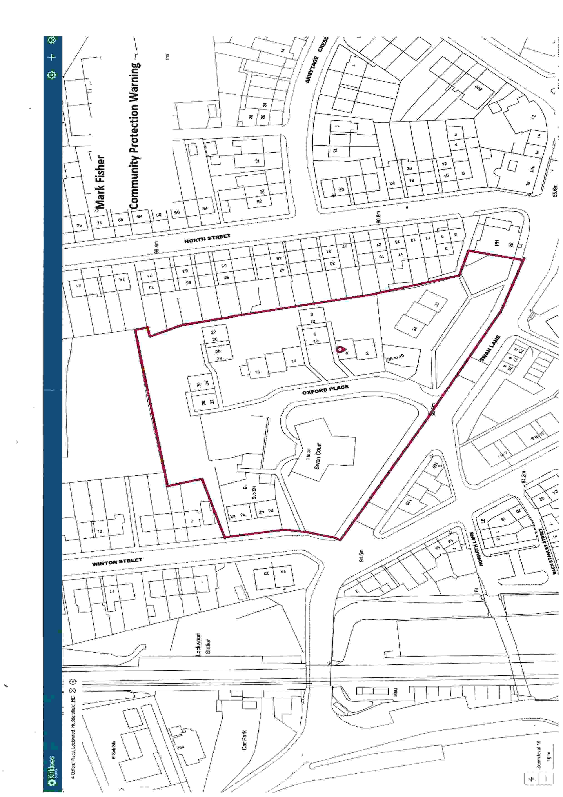

These two numpties dropped by but refused to identify themselves.
They sprung me with a ludicrous community order, designed to protect the terrorists
and hard crime rings that are known to frequent this local area.

So far, they have ignored my complaints and are being put on notice. The problem
residents are being moved from the area.

Here they are in action - pay special attention to the *Walk of Shame*!

<iframe width="640" height="360" src="https://www.youtube.com/embed/TW-ZM9X8Etc" title="Bogus Kirklees Council worker tries to censor my social media" frameborder="0" allow="accelerometer; autoplay; clipboard-write; encrypted-media; gyroscope; picture-in-picture; web-share" allowfullscreen></iframe>

