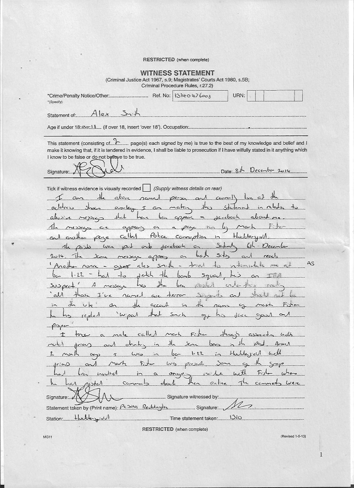
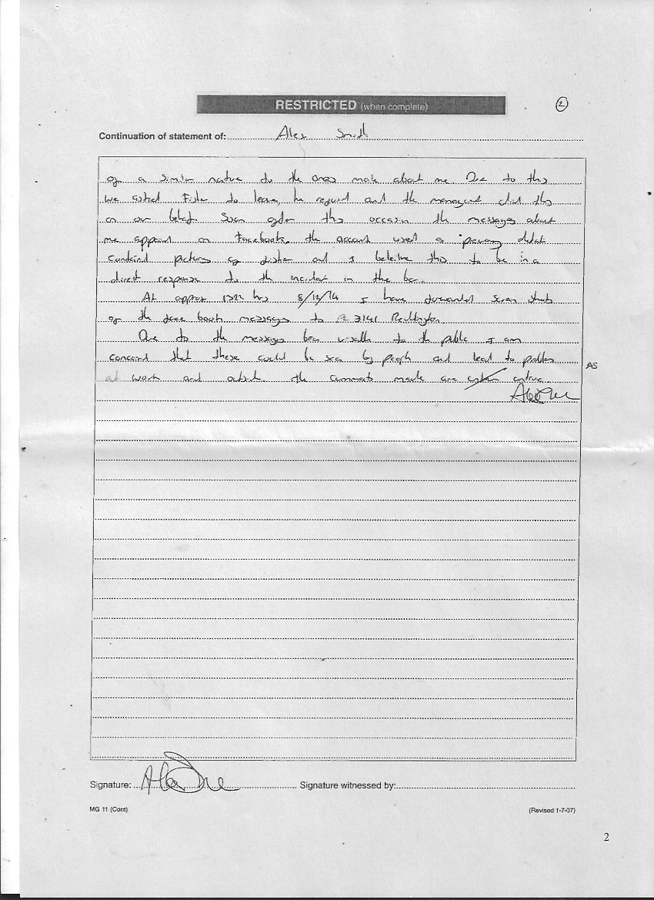
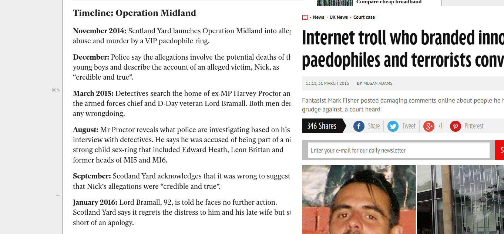

Among their known associates are
- [Ian Watkins](https://www.bbc.com/news/uk-wales-25412675) of "Lost Prophets"
- [Richard Tasker](https://www.examinerlive.co.uk/news/west-yorkshire-news/huddersfield-man-who-claimed-computer-19195419) the pedophile bar manager 
- [Neil Gilpin](https://www.examinerlive.co.uk/news/west-yorkshire-news/paedophile-neil-gilpin-slaithwaite-jailed-12212597) the pedophile judo teacher who dragged a boy into a ditch
- [Carl Beech](https://www.bbc.com/news/uk-49048972) now in jail for perjury and illegal material involving children

_And how many more..?_

Here is the statement Alex Smith gave to police

The fake evidence was used by corrupt district judge
Michael Fanning to issue a hospital order,
having me locked up indefinitely!

### Strangely, only Maxwell's rags covered the story, [here in the Daily Mirror](https://www.mirror.co.uk/news/uk-news/internet-troll-who-branded-innocent-5433295), and [here in the Huddersfield Examiner](https://www.examinerlive.co.uk/news/west-yorkshire-news/mark-fisher-detained-huddersfield-paedophilia-8948683).

The allegations of mental illness were quickly disproved, with the arrest of pedophile Neil Gilpin, who had been pardoned several times by the same court.

My imprisonment coincided with the corrupt "operation midland", where my close friend
Sir Edwin Bramall was wrongfully arrested
and had his private apartment searched,
after a series of unsubstantiated allegations
were raised by pedophile Carl Beech, who
had been previously been spotted spying around my home.

My arrest and capture was to prevent me discovering the "operation midland" because
I had previously wreaked revenge against a 
different corrupt machination by these officers - 
the failed "operation ore", where I penetrated
the shoddy webserver (which had no password) and simply erased all the data on C:\ .

This is the pub where Ian Watkins would met with a group of employees, Richard Tasker and Andrew Wright, where a secret wifi network was found.

["The Parish"](https://www.examinerlive.co.uk/whats-on/music-nightlife-news/huddersfield-pub-parish-moving-key-18577105)  (which has changed hands and moved since that time)

The routers were strangely positioned opposite the ladies toilet, when there was an empty shelf above the stairwell that would have been ideal. 
A simple network sniffer revealed that there was an additional network installed, that had internet access. Our researcher penetrated this, and was physically ill.

