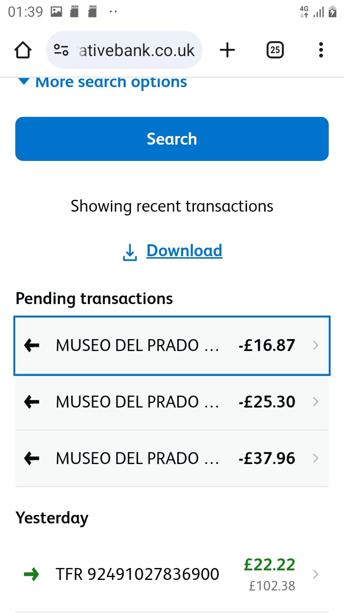

During my unlawful arrests, officers at Huddersfield police were heard discussing packaged holidays in Spain.

One of these arrests, for an alleged breach of bail which happened after reporting terrorist activity at Kirklees Council, came immediately after I contacted KMC-legal for representation. During my 3 day detention, officers asked to be allowed to access my wallet in order to obtain a business card for a different solicitors, which they allegedly could not find. When I returned home, I noticed several unauthorised transactions on my bank account, which were to a museum in Madrid - not too far from Marbella.

<!--StartFragment-->

[KMC LEGAL AND FINANCE LIMITED](https://kmc-legal.co.uk/contact-us)

<!--EndFragment-->

Notice how their name is very similar to a legitimate solicitors, who do not do criminal defence, with only a single character differentiating their website - kmc-legal.co.uk with the genuine firms, kmclegal.co.uk . Plain evidence that something illicit is happening.

Also, after reporting these to the fraud office, an arrest was made of an officer working in Bradford who made fraudulent transactions, including using a dead persons bank card.\
<!--StartFragment-->

[Sacked female Met police officer, 28, used dead person's bank card to go on £300 Deliveroo and Amazon spree | Daily Mail Online](https://www.dailymail.co.uk/news/article-14020647/Met-police-officer-dead-bank-card-Deliveroo-Amazon.html)

<!--EndFragment-->

At the same time, a targeted blackmail/extortion email campaign was enacted against myself, with hundreds of messages of personalised messages appearing in my inbox. When I informed KMC-legal of this, they attempted to dismiss it as ordinary spam. After I reported them, the campaign was restarted but stopped immediately when I began forwarding the messages to their inbox.

This was their initial response:

<!--StartFragment-->

> I have read through the below message that you have sent. These are spam messages that people send out to a mass of people in the hope that it will scare some of them into making payments. My advice would be to completely ignore them, change your passwords regularly and don't click on any links or emails which look like they are coming from these addresses/ are trying to blackmail you. The likelihood is they do not have any information on you apart from your password and are just trying to make money off you. For example, notice how they refer to you as "fish" which is part of your email and not "Mark" or "Fisher". This is probably because they don't actually know your name. 
>
> Many people I know receive these sorts of emails and all of them contain the exact same message with just the name and password changed. Therefore I would not worry that it is a specifically targeted email, it is just someone trying to make money out of scaring people. 
>
> <!--EndFragment-->

However, we can see from the content of the messages and their subject line that the campaign was targeted at me personally:

They also attempted to lie to the courts, which has been reported to the regulation authority and the fraud squad.

It is quite obvious that these events are connected.